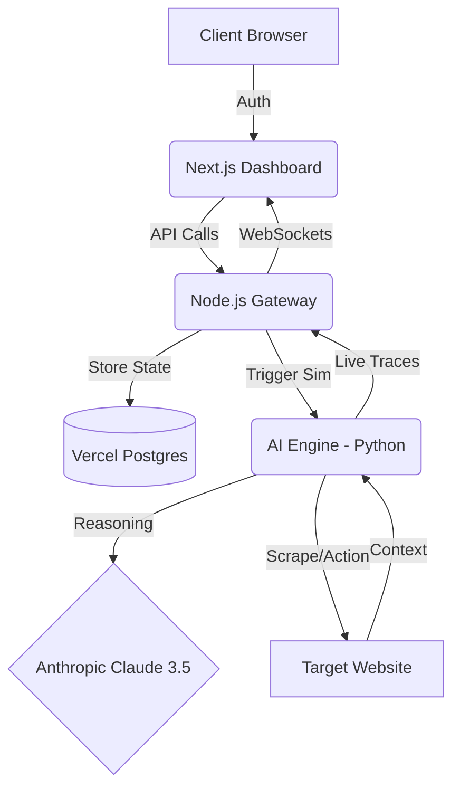

# ShadowTest 🛡️

### **Autonomous User Experience & Behavioral Logic Testing**  
*The world's first AI-native testing platform that discovers UX friction before your users do.*

---

[**Business Case**](./BUSINESS_CASE.md) | [**Checklists**](./CHECKLISTS.md) | [**Explore the Docs**](./DEPLOYMENT.md) | [**View PRD**](./ShadowTest-PRD.md)

---

## ❓ The Problem & Solution

### **The Problem**
- **Manual QA is slow:** Testing every path manually takes weeks.
- **E2E Scripts are brittle:** Standard tests (Cypress/Selenium) break on minor CSS changes.
- **Behavior is invisible:** You know *where* users drop off, but not *why* they were confused.

### **The Solution: ShadowTest**
ShadowTest simulates **High-Reasoning Synthetic Personas** that think, navigate, and get confused like real humans. 
- **Saves Time:** Run 100 autonomous user sessions in 10 minutes.
- **Saves Money:** Reduce developer hours by 70% and slash customer churn by identifying UX friction before launch.

---

## 🏗️ Software Architecture

ShadowTest uses a distributed microservices model to handle long-running AI reasoning loops separately from the user dashboard.

### **System Components**
| Component | Technology | Role |
| :--- | :--- | :--- |
| **Frontend** | **Next.js 16**, Tailwind, Clerk | High-performance dashboard & live monitoring. |
| **Core API** | **Node.js**, Express, Prisma | Orchestration, state management, and persistency. |
| **AI Engine** | **Python**, FastAPI, Claude 3.5 | High-reasoning behavioral simulation & autonomous browsing. |

---

## 🏁 Getting Started
Refer to the **[Production Deployment Guide](./DEPLOYMENT.md)** for Vercel and Render instructions.

---

*Copyright Developed with ❤️ by Harsh Mriduhash*