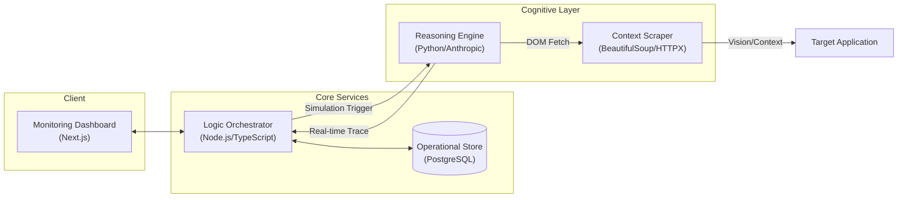

# ShadowTest 🛡️

### **Autonomous User Experience & Behavioral Logic Testing**  
*The world's first AI-native testing platform that discovers UX friction before your users do.*

---

[](https://opensource.org/licenses/MIT)
[](https://nextjs.org/)
[](https://www.python.org/)
[](https://anthropic.com/)

[**Explore the Docs**](./DEPLOYMENT.md) | [**View PRD**](./ShadowTest-PRD.md) | [**Request Demo**](mailto:harshsahay2709@gmail.com)

---

## 🚀 The Vision

Traditional testing (Unit, Integration, E2E) validates **code**. ShadowTest validates **behavior**. 

ShadowTest leverages high-reasoning LLMs to simulate synthetic personas—ranging from technical experts to novice users—who navigate your product autonomously. By observing their reasoning traces, ShadowTest identifies confusing UI, broken flows, and edge cases that standard automated scripts simply cannot catch.

## ✨ Core Value Proposition

*   **Behavioral Realism**: Test with personas like "The Impatient Developer" or "The Non-Technical Founder."
*   **Zero-Maintenance Tests**: No more brittle selectors. Describe the task in plain English, and the AI figures out how to execute it.
*   **Live Reasoning Trace**: Watch the AI's internal monologue: *Observation → Interpretation → Decision → Action*.
*   **Universal Compatibility**: Simply provide a URL. ShadowTest analyzes the DOM in real-time to interact with any web application.

---

## 🛠️ Enterprise Technology Stack

ShadowTest is engineered as a scalable, microservices-driven monorepo.

| Component | Technology | Role |
| :--- | :--- | :--- |
| **Frontend** | **Next.js 14**, Tailwind, Framer Motion | High-performance dashboard & live monitoring. |
| **Core API** | **Node.js**, Express, Prisma ORM | Orchestration, state management, and persistency. |
| **AI Engine** | **Python**, FastAPI, Claude 3.5 Sonnet | High-reasoning behavioral simulation & scraping. |
| **Database** | **PostgreSQL** (PostGIS enabled) | Relational storage for projects, personas, and traces. |

---

## 🏗️ System Architecture

Our decoupled architecture ensures that heavy AI reasoning tasks never block the user experience.



---

## 📁 Repository Structure

```text
/apps
├── ai-engine/    # Cognitive reasoning & autonomous browsing logic
├── api/          # Secure RESTful API & database orchestration
├── web/          # Modern enterprise dashboard & live trace UI
├── render.yaml   # Infrastructure-as-code for Render deployment
└── README.md     # Project overview & documentation
```

---

## 🏁 Getting Started

### Prerequisites
*   Node.js 18+ & Python 3.9+
*   Anthropic API Access (Claude 3.5 Sonnet recommended)
*   PostgreSQL Instance

### Quick Start (Local Environment)

1.  **AI Engine**:
    ```bash
    cd apps/ai-engine && pip install -r requirements.txt && python main.py
    ```
2.  **API Gateway**:
    ```bash
    cd apps/api && npm install && npx prisma db push && npm run dev
    ```
3.  **Frontend**:
    ```bash
    cd apps/web && npm install && npm run dev
    ```

---

## 🚢 Deployment & Scale

ShadowTest is production-ready for horizontal scaling:
- **Stateless API**: Deploy to Vercel or Railway for instant scaling.
- **Async Engine**: Dockerized AI engine suitable for Kubernetes or Render.
- **Serverless DB**: Native support for Neon or Supabase.

Refer to our **[Production Deployment Guide](./DEPLOYMENT.md)** for detailed instructions.

---

**Primary Contact**: Harsh Mriduhash ([GitHub](https://github.com/harshmriduhash))

---

**Copyright Developed with ❤️ by Harsh Mriduhash**